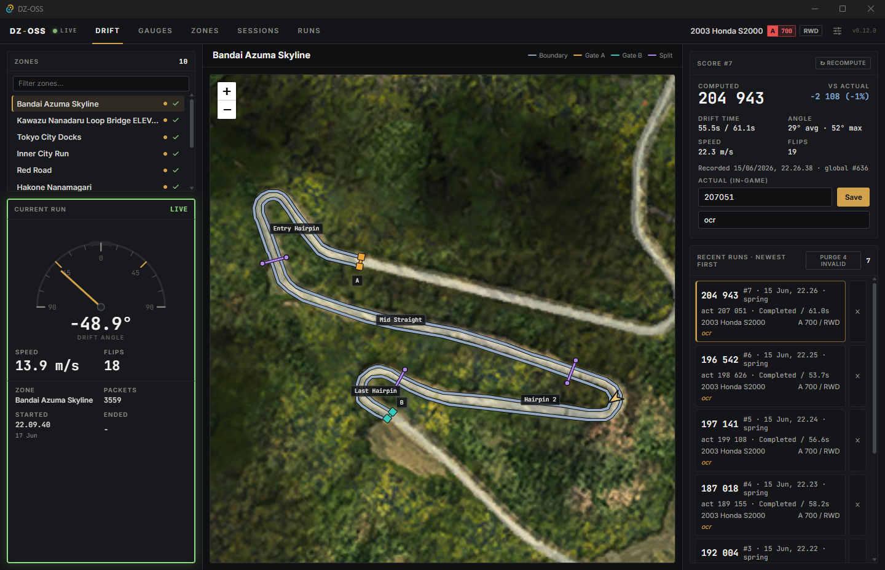
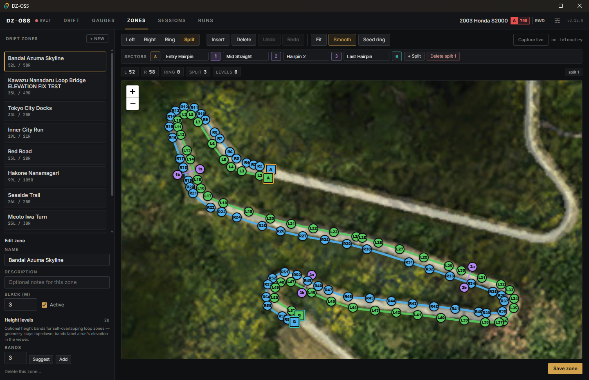
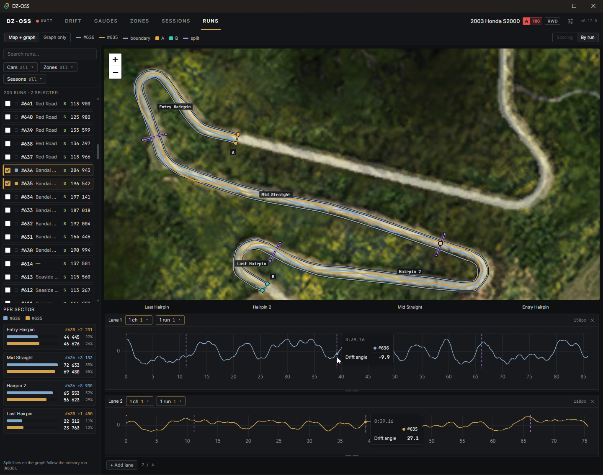

# DZ-OSS

[](LICENSE)


**DZ-OSS** (*Drift Zone Original Scoring System*) is a real-time telemetry app for
**Forza Horizon 6**, built around a **drift-scoring workbench** that reconstructs the
game's own drift-zone scoring from the UDP feed — plus a full gauge cluster, a
recorded-run analyser, and automatic session recording. Desktop app (Tauri + Svelte)
for Windows; an optional headless server hosts the same dashboard cross-platform.
[Build and run from source](#running-from-source).



## Drift Workbench

The headline feature. DZ-OSS ships with the festival's drift zones already mapped, so
the moment you install it you can drive a zone, have the app detect the run, estimate
its score live from the telemetry, and keep a per-zone history to check against the
game's actual number.

Curious how the score is reconstructed from the feed? See
[**How the Drift Scoring Works**](docs/scoring.md) — the model, the evidence behind it,
and its known limits.

- **Zones included** — ten drift zones are bundled and seeded on first launch (it never
  touches zones you've made yourself). Map your own in the **Zones** editor: smooth
  curved or straight boundaries, two end gates, and optional split sectors and height
  bands for multi-level loop courses.
- **Bidirectional runs** — enter through either gate, finish through the other.
- **Live scoring** — a signed drift-angle needle, speed, and a flip counter while you
  slide, then a score the moment the run ends. Scoring is **season-aware** (FH6 credits
  off-road drift differently across the weekly festival seasons) and runs on every
  64 Hz packet.
- **Run history & comparison** — every run is stored per zone with a full breakdown.
  Enter the game's actual score to compare it against the estimate, add notes, and
  one-click recompute. In-game **rewinds are detected and corrected** so a rewound run
  doesn't inflate its estimate.



## Run Viewer

The **Runs** tab replays any recorded drift run for analysis: the driven line over the
zone map (coloured by where you were actually banking points), a synced multi-lane
datalogger (drift angle, speed, inputs, G-force…), a **per-sector** points breakdown,
and side-by-side comparison of several runs at once.



## Other Features

- **Live gauges** — the **Gauges** tab: speed, RPM, gear, compass heading, attitude
  indicator, G-meter, steering + pedal inputs, lap times, and tire temps. The track map
  can pop out into its own window.
- **Session recording** — timed events (races, Rivals, Time Trial) auto-record every
  packet to SQLite, with a replay + analysis viewer (input / speed / G-force / tire
  charts and the driven line). Survives in-race rewinds.
- **Track map** — the driven racing line over the *Forza Horizon 6: Japan* map,
  calibrated to world coordinates from two landmarks.
- **Headless web server** *(optional, cross-platform)* — serve the same dashboard over
  HTTP to any browser on your network, hosted from Windows, Linux, or macOS. See
  [docs/headless-server.md](docs/headless-server.md).

## Forza Horizon 6 Setup

1. In FH6, open **Settings → HUD and Gameplay**.
2. Under **DATA OUT**, set **Data Out** to **On**.
3. Set **Data Out IP Address** to `127.0.0.1` and the **Data Out IP Port** to match
   DZ-OSS — `20440` by default, changeable any time under the app's **Settings**.

A green dot in the app's top-left confirms packets are arriving. Data is stored at
`%LOCALAPPDATA%\fh6-tel\sessions.db`.

> **Running alongside other telemetry apps.** Only one program can bind the game's
> telemetry port at a time, so DZ-OSS can't share it with another tool (e.g. Segue)
> while both are running. To use them together, point Forza at a UDP forwarder that
> rebroadcasts the feed to several local ports — SimHub's telemetry forwarding does
> this — and give each app its own port.

## Running from Source

Prerequisites: a stable Rust toolchain and Node.js 24 (the current LTS — CI builds against
`lts/*`). Windows also needs WebView2, pre-installed on Windows 10/11.

```bash
npm install
npm run tauri dev      # hot-reloading dev app
npm run tauri build    # production installer (output under src-tauri/target/release/bundle/)
```

The desktop app targets Windows, since Forza Horizon 6 is Windows/Xbox only. To run
DZ-OSS on Linux or macOS, build the headless server instead — see
[docs/headless-server.md](docs/headless-server.md).

## Status & Known Limitations

DZ-OSS is pre-release and under active development. The drift score is a
*reconstruction* of the game's hidden scoring — accurate to a few percent, but an
estimate, not the game's own number. The main current limits: the hidden
scoreable-zone boundary isn't mapped yet (so off-road overshoots can over-score),
summer/autumn off-road credit is unverified, there's no live ticking score during a run,
only one app can use the telemetry port at a time, and the desktop app is Windows-only.
See [**Known Bugs & Limitations**](docs/known-issues.md) for the full list.

## License

DZ-OSS is MIT-licensed — see [LICENSE](LICENSE). It began as a fork of
[fh6-tel by BanHammer](https://github.com/TheBanHammer/fh6-tel) — the telemetry
foundation it's built on — and has since grown into its own project, maintained
independently. Thanks to BanHammer for the original work.
