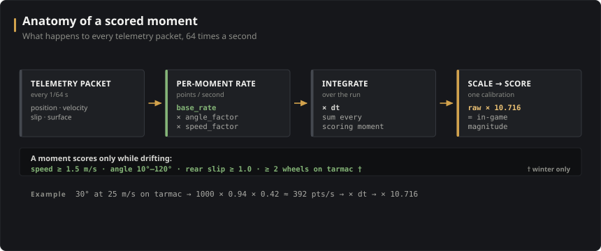
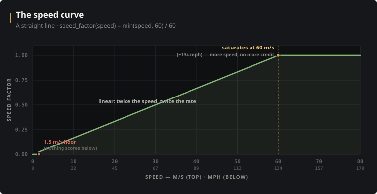

# How the Drift Scoring Works

Forza Horizon 6's drift zones hand you a score at the end of a run, but the game
never tells you *how* it got there. There's no published formula — just a number
that ticks up while you're sideways and freezes when you're not.

DZ-OSS aims to reproduce that formula. It watches the same thing the game watches —
the car's motion, 64 times a second — and works the drift score out from scratch,
so the app can estimate a run's score the instant it ends and tell you *where*
the points came from.

This document explains the model: what every term does, why it's shaped that
way, and how we know it's right. It's an approximation inferred from the outside,
not the game's source code, so it's framed throughout as "this is what the evidence says the game
does." Where the model has known gaps, this doc says so.

The whole estimator lives in [`src-tauri/src/scoring.rs`](../src-tauri/src/scoring.rs);
the run lifecycle (gates, starvation, rewinds) lives in
[`src-tauri/src/drift.rs`](../src-tauri/src/drift.rs); the seasonal rule is in
[`src-tauri/src/season.rs`](../src-tauri/src/season.rs).

---

## The short version

Every 1/64th of a second, the game (we believe) asks: *is the car sliding?* If
so, it adds points proportional to **how sideways** the car is **× how fast**
it's going, for **that slice of time**. Add those slices up over the whole run,
multiply by one calibration constant, and you have the score.

```
score  =  scale × Σ ( base_rate × angle_factor × speed_factor × dt )
                  over every packet where the car is drifting and scoring
```



Everything below is detail hung on that one line: what makes a moment "count,"
how angle and speed translate into a factor, and the handful of special cases
(very low speed, off-road surfaces, seasons) where the simple picture needed
refining.

---

## What the game tells us

Forza broadcasts a UDP telemetry packet on a fixed **64 Hz tick** (~15.6 ms
apart) — the "Car Dash" data-out format. Each packet is a 324-byte snapshot of
the car: position, velocity, acceleration, per-wheel slip and surface, inputs,
yaw/pitch/roll, and more. DZ-OSS records every packet of a run so it can be
re-scored later.

Two facts about this feed do most of the heavy lifting:

1. **Velocity is in the car's own frame, not the world's.** Forza reports
   `velX` / `velY` / `velZ` relative to the *chassis* — `velX` is sideways,
   `velZ` is forward. This is the single most useful thing in the packet for
   drift detection (see the next section).

2. **Timestamps are exact and self-clocking.** Each packet carries its own
   millisecond stamp, so the time slice `dt` is measured from the data, not
   assumed. Duplicate stamps (the feed sometimes repeats one) telescope to a
   zero-length slice, and an abnormally large gap — a pause, an alt-tab, a
   rewind — is treated as a stall rather than real driving time.

---

## Step 1 — The drift angle

A "drift" is the car travelling in a different direction than it's pointing. The
angle between *where the car is going* and *where it's facing* is the **sideslip
angle**, and it's the core input to the whole model.

Because Forza already gives us velocity in the car's local frame, the sideslip
angle falls out of a single `atan2`:

```
drift_angle  =  atan2(velX, velZ)        // velX = lateral, velZ = longitudinal
```

No yaw, no heading, no fudge constant. When the car drives straight, `velX ≈ 0`
and the angle is ~0°; when it's sliding, `velX` grows and so does the angle. The
sign tells you which way it's sliding (left vs right), which matters later for
counting direction changes.

> **Why this is worth stating.** An earlier version of the model computed the
> angle from world-frame velocity minus yaw. It looked fine — because every
> drift run happened in the same zone, at the same heading, which hid the error.
> Tested across all headings on straight driving, the local-frame formula sits
> at a mean of **0.03°** (std 0.45°): essentially zero, exactly as it should.
> The yaw-based one did not. Getting the angle right dropped one early run from
> a bogus 77,850 to ~58,294 by removing phantom 75–90° angles that were never
> really there.

---

## Step 2 — Points per moment

With the angle in hand, the per-moment scoring rate is a product of three
factors:

```
points_per_second  =  base_rate × angle_factor(angle, speed) × speed_factor(speed)
```

- `base_rate` (default **1000**) is the nominal points-per-second at full angle
  and full speed. It's an arbitrary scaling unit — the real magnitude is set by
  `scale` at the very end.
- `angle_factor` is a 0–~1.09 curve over drift angle (Step 3).
- `speed_factor` is a 0–1 ramp over speed (Step 4).

Multiply by the time slice `dt` and accumulate over the run. There is **no combo
multiplier** — and that's a deliberate, tested decision, not an omission.

> **Why no combo?** Forza's on-screen counter *looks* like it has a building
> multiplier, so the model originally had one too. But when you fit the logged
> in-game scores against the raw integral, the relationship is almost perfectly
> **linear** (the best-fit exponent is 1.00 — pushing it to 0.95 or 1.05 makes
> the fit visibly worse). A run that scores twice as much simply spent twice as
> much "angle × speed × time" sideways. The combo machinery is still in the code
> as a per-zone override for experiments, but it's off by default and fitting
> says to keep it off.

The same fit also showed the score is **car-independent**: giving every car its
own calibration improves the fit by a negligible amount. The game scores the
*motion*, not the machine — so there is deliberately no per-car, per-class, or
per-drivetrain term.

---

## Step 3 — The angle curve

How much does angle matter? Less than you'd guess. The `angle_factor` curve
encodes the answer:


Reading it left to right:

- **Below 10° → zero.** A nearly-straight car isn't drifting. (This gate used to
  sit at 12°; it was lowered to 10° once the surface gate, below, stopped
  off-road slides from polluting the data — those shallow 10–12° slides turned
  out to be real, scored slides.)

- **10° up to the 45° "sweet spot" → a steep, concave ramp.** The exponent
  (`angle_power = 0.15`) is well below 1, which means the curve shoots up right
  after the gate and then flattens as it approaches 1.0. In practice an 11°
  slide already earns ~80% of full angle credit. The headline consequence:
  **once you're past the drift gate, angle barely scales the score — speed and
  time dominate.** This single fact (low `angle_power`) is what fixed a
  long-standing tendency to under-reward shallow, fast slides.

- **45° → factor = 1.0**, the reference point. The factor is *defined* to equal
  1.0 here, so the sweet spot anchors the whole curve.

- **45° → 58° → a small rise to 1.085.** Steeper-than-sweet slides pay a little
  *more*, not less — about **+8.5%**, reached by ~58° and then held flat. (More
  on how we measured this just below.)

- **58° → 120° → a flat plateau** at 1.085. Big, lurid slides past 90° still
  score; the game keeps crediting them up to ~115°.

- **Above 120° → zero.** That's a spin, not a drift. Points stop.

> **How the +8.5% rise was measured.** This was the trickiest part of the curve.
> Early fits, constrained by limited steep-angle data, actually had the factor
> *declining* above 45°. To settle it, runs were recorded with the game's
> on-screen point tally visible, and the tally was read frame-by-frame with OCR
> to get ground-truth scoring *rate* at each instant — not just the run total.
> Pooled across 9 instrumented runs (4 cars, 4 zones, both seasons), the
> game's per-moment credit clearly **rises** just past the sweet spot and
> **saturates** around +8.5% by ~58°, holding flat past 100°. A saturating-step
> shape fits that with ~1.35% error, versus ~2.7% for a linear ramp and ~6.2%
> for a flat line. The decline was wrong; the rise is real.

---

## Step 4 — The speed curve

Speed is the simplest factor: a straight line.

```
speed_factor  =  min(speed, 60 m/s) / 60 m/s          // 0 below 1.5 m/s
```



- Below **1.5 m/s** (~3.4 mph) nothing scores — the car has to actually be
  moving, and below that the `atan2` angle is just noise anyway.
- From there it's **linear** all the way up, so doubling your speed doubles the
  rate.
- It saturates at **60 m/s** (~134 mph): beyond that, more speed doesn't add
  more per-moment credit.

The low 1.5 m/s floor exists because of "burnout cheese" — slow, lightly-angled,
rear-lit-up slides that the game *does* score. An earlier ~18 mph floor threw
those away.

---

## Step 5 — What counts as a slide: the gates

`angle_factor × speed_factor` only matters for moments that "count." A moment
counts as **drifting** when all of these hold:

| Gate | Default | Meaning |
|------|---------|---------|
| Speed | ≥ 1.5 m/s | the car is moving |
| Angle | 10°–120° | sideways, but not spun out |
| Rear slip | ≥ 1.0 | the rear axle is actually sliding |

The slip gate uses Forza's **rear combined-slip** value, which is normalized so
~1.0 is the grip limit; during a real drift the rears sit well past that. It
keeps a fast, slightly-angled cornering moment from being mistaken for a slide.

But "drifting" isn't quite the same as "scoring." There's one more gate, and
it's the most surprising one.

### The surface gate: at least two wheels on tarmac

Slide through the grass and the game gives you nothing — even though you're
clearly sideways. DZ-OSS mirrors this from the packet's **per-wheel surface
rumble** channel, which reads ~0 on a smooth surface and jumps well above it on
grass / dirt / gravel:

- A wheel counts as **on tarmac** when its surface rumble is ≈ 0.
- A moment **scores only if at least two wheels are on tarmac.** One wheel
  clipping the verge isn't enough; two is.

This was discovered by play-testing and then confirmed against the data: gating
fully-off-track moments to zero fixed a whole family of "deep grass" runs the
model had been wildly over-scoring. The "two wheels" threshold is sharp — one
wheel doesn't bank, two does, and front-vs-rear makes no difference. It's a
genuine binary mechanic, not a tunable knob.

> This also reframes the painted zone boundary. The polygon you draw on the map
> is used **only to detect the entry gate-crossing** — it is *not* what decides
> whether a moment scores. You can earn points on a tarmac side-road technically
> outside the painted zone, and earn nothing on grass inside it. The surface
> gate, not the polygon, is the real arbiter. (With one important exception —
> see "The hidden scoreable zone" below.)

### Seasons change the surface rule

Here's the twist: **the surface gate is seasonal.** FH6 rotates festival seasons
weekly (every Thursday 14:30 UTC). In **winter**, off-tarmac moments score
nothing — the gate above is fully in force. In **spring**, the game pays grass
at the *full* rate, as if the surface gate didn't exist.

We measured this directly: a heavy-grass run scored −15% against the game under
the winter rule, but −0.6% with the gate switched off — and frame-by-frame the
grass moments were banking at the normal rate. So DZ-OSS binds each run to the
season it was driven in (from its wall-clock start time) and applies the gate
only in winter.

Summer and autumn are **assumed to pay** (spring-like) until their first weeks
arrive and can be measured — the reading being that winter's zeroing is snow
burying the off-road surface. The season is derived on demand from a measured
anchor date; it's never stored, so correcting the schedule re-binds every
recorded run at once.

---

## Step 6 — The low-speed composite

At normal speeds the simple `angle × speed × time` integral nails the game. At a
crawl — think tight, technical, sub-walking-pace link sections — three small
corrections kick in. Each one fades out as speed rises, so they're invisible to
ordinary runs and only shape the slow stuff.

1. **Below-sweet steepening.** At crawl speed the game is *stingier* about
   shallow angles than at speed. The sub-sweet ramp steepens (its exponent gains
   up to +0.22) below ~16 m/s, deepening toward both low angle and low speed.
   It's **anchored at 45°**: the sweet spot and everything above it always pay
   full rate, at any speed — only the shallow band gets pinched.

2. **Per-flip pause.** Every time the slide flips direction at low speed, there's
   a brief banking pause — the game seems to need a moment to re-establish the
   drift. The model suppresses in-band credit for a short window (~0.04 s) after
   each direction flip, weighted so it's gone by ~16 m/s. Frame-by-frame, every
   low-speed flip sits in a measurable 0.5–1.5 s banking lull.

3. **Transit credit.** Conversely, when a slide briefly dips below the gate (a
   flick through straight, a momentary speed or slip dip) and then *resumes*, the
   game pays through the dip rather than dropping it. The model re-pays a capped
   slice of the dip (up to 0.5 s) at the last good rate × 0.40, again only at low
   speed (gone by ~11 m/s). Crucially this is banked only when the slide actually
   resumes — a run that ends mid-dip gets nothing for it.

These three were fit *together* against the slow-run data and against the
frame-by-frame vision tally, and they bring the crawl-regime error from ~6.7%
down to ~1.5% without disturbing normal-speed runs.

---

## Step 7 — Starting, finishing, and dying

The score model above runs over a *run* — but what defines a run?

- **Start / finish gates.** A zone has two end gates. A run begins when the car
  crosses *between* the two posts of one gate while entering the zone, and ends
  when it crosses the *other* gate. Zones are bidirectional: enter through
  either, finish through the other. The gates are always derived from the current
  boundary, so editing a zone can't leave them stale.

- **Death by starvation.** A run doesn't end when you leave a painted area — it
  ends when you **stop scoring for too long**. If no moment banks points for a
  few seconds (default 5 s, configurable), the run is declared dead. This mirrors
  the game's real fail condition: wander into the scenery and stop drifting, and
  the run quietly expires. Paused / alt-tabbed / stalled time is excluded from
  this timer, so a pause can't kill a run.

- **Surviving rewinds.** The in-game rewind feature doesn't end a drift run, and
  it's heavily used in fast zones. A rewind shows up in the recording as a
  telemetry gap followed by a large *backward* position jump (a pause, by
  contrast, resumes in place). DZ-OSS detects these, and when re-scoring a run it
  drops the replayed stretch so the estimate matches what the game kept rather
  than double-counting the abandoned attempt.

- **Where the points came from.** A zone can be split into named sectors. On the
  run viewer, each recorded moment is tagged with its sector by counting
  split-gate crossings from the entry (monotonic, so weaving across a line can't
  bounce the count), and the points roll up per sector — they sum exactly back to
  the run total.

---

## The hidden scoreable zone (a finding, not yet in the model)

This is the most intriguing thing we've found, and in the interest of honesty
it is **not yet part of the scorer.**

In spring, with the surface gate switched off, scoring is *still* gated — by
**position.** There appears to be a hidden scoreable region, tighter than the
painted flags, sitting inset from the gates. Slide off-road **inside** that
region and it pays; make the same slide **outside** it and it doesn't (and the
run isn't aborted — it simply earns nothing out there). We've confirmed this with
paired runs at one zone: a bold off-road line inside the region banks; an
overshoot outside it does not.

There's a strong hint it's the same mechanism behind a separate ~10–14 m
"entry credit offset" seen at another zone, where the gate and its sound effect
fire but points only start accruing a little further in.

The boundary of this region hasn't been mapped yet — doing so needs the
frame-by-frame vision pipeline to trace exactly where the tally freezes. Until
it's mapped, the current model uses the **per-wheel surface gate** (Step 5) as
its surface proxy, which handles the common cases well. Adding a true position
gate is the next accuracy lever on the list.

---

## How we know it's right

The model isn't tuned by feel. Every parameter is anchored to evidence:

- **Least-squares against logged scores.** After each run, the real in-game score
  is entered into the app. The single `scale` constant is fit across the whole
  corpus — currently ~360 runs spanning five zones and a range of cars/classes —
  by least squares. At the current settings the model lands at roughly **1.4%
  mean absolute error** with a slight negative bias, and every zone sits inside
  ~1–1.7%. (`scale` is the *only* free magnitude knob; it is not re-fit per run.)

- **Frame-by-frame vision ground truth.** Run totals can hide shape errors — two
  wrong curves can integrate to the right number. To catch that, runs were
  recorded with the on-screen tally visible and OCR'd frame by frame, giving the
  scoring *rate* at every instant. That's what pinned the steep-angle rise and
  the low-speed composite, which a totals-only fit couldn't have resolved.

- **Controlled experiments.** Where a totals fit was ambiguous, deliberate runs
  settled it: progressively wider off-track lines to prove the surface gate;
  matched fast/slow weave runs to isolate the flip pause; runs straddling a
  season boundary to prove the seasonal rule.

- **Things we tested and threw away.** Discipline cuts both ways. A combo
  multiplier, per-car / per-class / per-drivetrain terms, a yaw-rate term, a
  tire-slip dampening factor, throttle / brake / steering / handbrake effects,
  wheelspin, and collision penalties were all tested **per-moment** against the
  data — and all rejected, because their apparent signal dissolved into the
  angle/speed confound once controlled for. The model is deliberately small.

- **Known blind spot.** One gap is structural: the game rewards **shallow but
  fast** slides slightly more than `angle × speed × time` can express, and no
  available telemetry channel recovers the difference. Combined with irreducible
  run-to-run variance in the game's own scoring (two near-identical runs can
  differ by ~25%), this sets a floor of roughly 1.4% MAE. The model is at that
  floor; the remaining lever is data quality and the position gate above, not new
  terms.

---

## Parameter reference

All of these are defined in
[`ScoringParams`](../src-tauri/src/scoring.rs) and are overridable **per zone**
via a zone's `scoringConfig` JSON — an empty `{}` yields all defaults, and any
key overrides just that one.

| Parameter | Default | Role |
|-----------|---------|------|
| `minSpeedMs` | 1.5 | speed floor (m/s); below it nothing scores |
| `minAngleDeg` | 10 | drift gate (°); below it nothing scores |
| `spinAngleDeg` | 120 | spin-out cutoff (°); above it nothing scores |
| `sweetAngleDeg` | 45 | angle where the factor = 1.0 (the anchor) |
| `anglePower` | 0.15 | shallow-ramp exponent (<1 ⇒ angle barely scales credit) |
| `aboveSweetRise` | 0.085 | extra credit at steep angle (+8.5%) |
| `riseSaturationDeg` | 58 | angle where the rise plateaus |
| `aboveSweetDecline` | 0.0 | (override-only) decline above sweet; off by default |
| `speedCapMs` | 60 | speed where the speed factor saturates (~134 mph) |
| `slipGate` | 1.0 | rear combined-slip threshold for "sliding" |
| `baseRate` | 1000 | nominal points/second at full factors |
| `requireTarmacContact` | true | enable the surface gate (winter only at runtime) |
| `minTarmacWheels` | 2 | wheels on tarmac required to bank |
| `lowspeedPowerAdd` | 0.22 | low-speed below-sweet steepening |
| `lowspeedFullMs` / `lowspeedZeroMs` | 3 / 16 | speed fade for the steepening |
| `flipPauseS` | 0.04 | per-flip banking pause (s) |
| `flipPauseZeroMs` | 16 | speed where the flip pause fades out |
| `transitGain` | 0.40 | through-dip re-pay gain |
| `transitZeroMs` | 11 | speed where transit credit fades out |
| `multGrowthPerS` / `multCap` | 0.0 / 1.0 | combo multiplier (disabled) |
| `transitionGraceS` | 0.5 | max out-of-band dip still counted as a linked flick |
| `scale` | 10.716 | final raw-points → in-game-magnitude factor (least-squares fit) |

---

## Caveats

This is a **model inferred from observed behaviour**, not the game's actual
scoring code. It's accurate to ~1.4% on the runs measured so far, but:

- Summer and autumn off-tarmac behaviour is **assumed**, not yet measured.
- The hidden position gate is **confirmed but not implemented** — off-road
  overshoots outside the real scoreable region are currently over-credited.
- The shallow-fast blind spot and the game's own run-to-run variance are
  irreducible with the telemetry available.

The model evolves as more runs are logged. The defaults in
[`scoring.rs`](../src-tauri/src/scoring.rs) are always the source of truth; this
document describes the model as it stands there.
